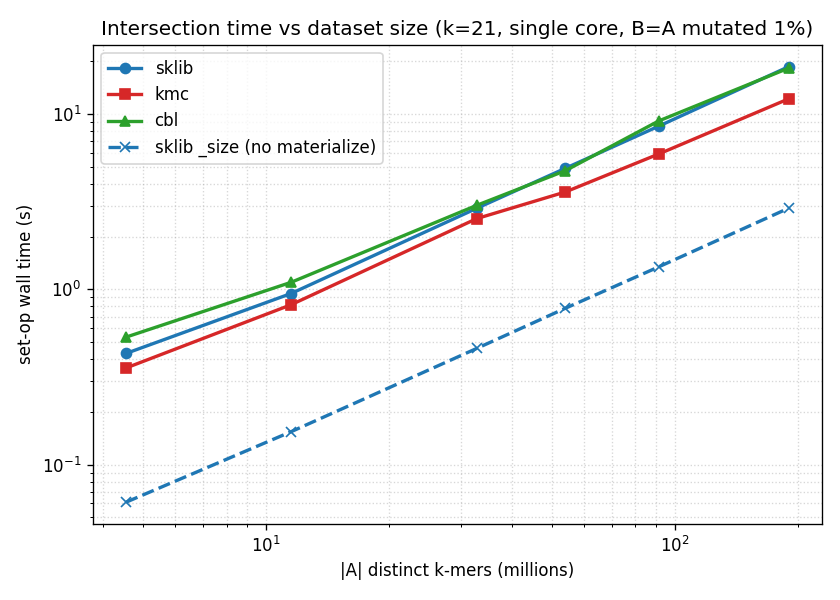
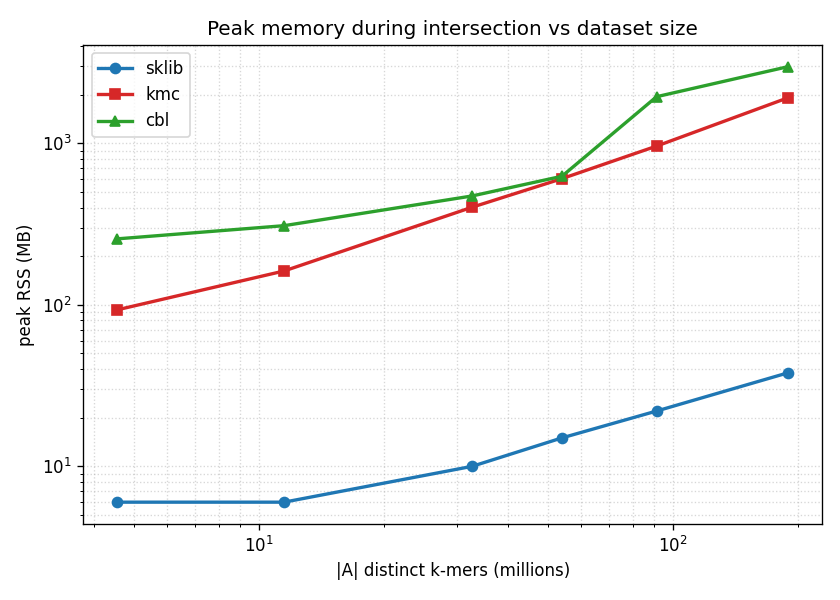
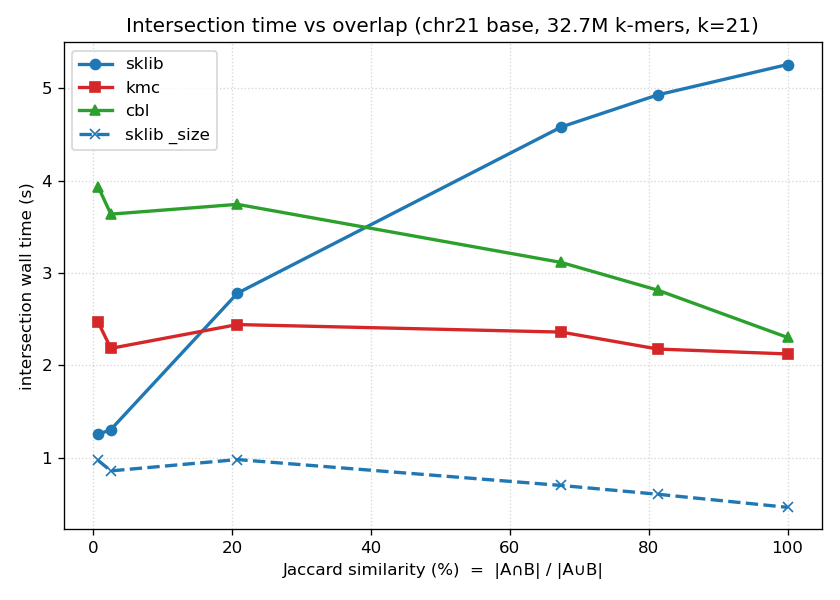
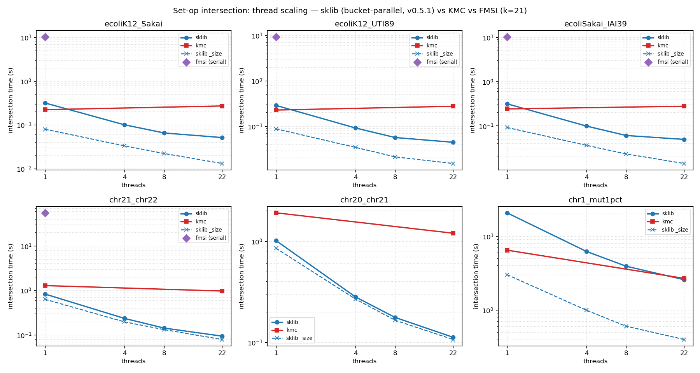

# Benchmark — opérations ensemblistes sur k-mers : sklib vs KMC vs CBL vs FMSI

**Date :** 2026-06-07 · **Machine :** Intel Core Ultra 7 165H (22 cœurs), 62 Gio RAM · k = 21 (impair, requis par CBL), m = 11 (sklib). sklib **Release** v0.5.0 + **set-ops parallèles par bucket** (v0.5.1, `-t`, voir §7) ; les optimisations séquentielles antérieures donnaient déjà **~1.6×**.

## TL;DR

| critère | verdict |
|---|---|
| **Mémoire** | 🟢 **sklib gagne massivement** : ~constante (5→29 Mo de ecoli à chr1) vs KMC ×66, CBL ×103 à grande échelle |
| **Cardinalité seule (`_size`)** | 🟢 **sklib unique et ~×3 plus rapide** que « matérialiser puis compter » (KMC/CBL n'ont pas d'équivalent) |
| **Compacité de l'index/sortie** | 🟢 **sklib ~25 bits/k-mer** vs KMC ~48, CBL ~43 |
| **Temps set-op (mono-cœur)** | 🟢 sklib gagne ∩ sur **toutes** les paires réelles (chr21∩chr22 : 0.81 vs KMC 2.04 s, ×2.5) et à overlap < ~40–50 %, et **diff partout** ; KMC ne garde l'avantage que sur l'union/∩ à très fort overlap |
| **Temps set-op (multi-cœurs, v0.5.1)** | 🟢 **parallélisme par bucket ×6–9** → sklib **le plus rapide dès `t≥4` sur quasiment tout**, y compris ∩ à fort overlap où KMC dominait (chr1 ∩ : **2.57 vs 2.68 s**) ; **KMC ne parallélise pas ses set-ops** (×1–2.4) et sa RAM explose (chr1 ∩ : **4.35 Go vs 0.69**) ; FMSI 100–1000× plus lent (§7) |
| **Correction** | 🟢 **accord exact sklib = KMC = CBL** sur les 6 quantités, vérifié sur données réelles ; sortie set-op **octet-identique quel que soit `-t`** (vs séquentiel + ThreadSanitizer) |

**Découverte clé :** le **temps sklib ∝ taille de la SORTIE** (matérialisation = re-compactage en super-k-mers), tandis que **KMC/CBL ∝ taille de l'ENTRÉE** (scan). Cela explique tous les résultats et indique où chaque outil est optimal.

---

## 1. Méthodologie

- **Outils.** sklib (`sskm setop`, build-bench **Release** ISA native, v0.4.2 + set-ops) ; **KMC** (`kmc` + `kmc_tools simple`) ; **CBL** (github.com/imartayan/CBL, binaire spécialisé par k, `--canonical`). **FMSI** *supporte aussi* les opérations ensemblistes (framework **f-MS expérimental** : `fmsi inter/union/diff`) — mesuré au **§9 (k-sweep)**, mais **20–100× plus lent** que sklib/KMC et bien plus gourmand en RAM (ex. ∩ ecoli : 11–13 s / 480 Mo vs sklib 0,3 s / 5 Mo) ; cardinalité validée vs KMC (union exacte ; ∩/diff < 0,1 %, écart de re-comptage). sshash, SBWT et BQF sont **membership-only** (pas d'opérations ensemblistes).
- **Modèle de mesure.** On construit chaque index **une fois** (mesuré à part), puis on exécute chaque opération sur les index **pré-construits** (lire 2 index → écrire 1 résultat — identique pour les 3 outils). `/usr/bin/time -v` → temps mur + RSS pic ; médiane de 3 répétitions pour les set-ops.
- **Équité threads.** Les §§3–6 sont **mono-cœur** (`taskset -c 0`, `kmc -t1`) pour isoler l'algorithme. Depuis v0.5.1 les set-ops sklib sont **parallèles par bucket** : le **§7** compare le scaling de sklib, KMC et FMSI de `-t 1` à `-t 22` (CBL reste mono-thread par conception, et indisponible dans cet environnement).
- **Cardinalités.** Fournies par le `_size` de sklib (rapide, sans matérialisation), **validées identiques à KMC et CBL** (§2).
- **Données.** Génomes réels (E. coli K12/Sakai/UTI89/IAI39, levure, *C. elegans*, humain chr1/20/21/22) + copies mutées contrôlées (`mutate.py`) pour un régime d'overlap constant en scaling.

## 2. Correction (accord à 3 voies)

E. coli K12 vs K12 muté 2 %, k=21 — **sklib = KMC = CBL exactement** :

| quantité | sklib | KMC | CBL |
|---|--:|--:|--:|
| \|A\| | 4 543 891 | 4 543 891 | 4 543 891 |
| \|B\| | 4 585 742 | 4 585 742 | 4 585 742 |
| ∩ | 2 984 901 | 2 984 901 | 2 984 901 |
| ∪ | 6 144 732 | 6 144 732 | 6 144 732 |
| A\\B | 1 558 990 | 1 558 990 | 1 558 990 |
| B\\A | 1 600 841 | 1 600 841 | 1 600 841 |

(Confirmé en plus par 10 tests unitaires + cross-validation KMC dans `tests/setop_verif.sh`.)

## 3. Scaling — temps vs taille (B = A muté 1 %, k=21, mono-cœur)

| génome | \|A\| Mk | ∩ sklib | ∩ kmc | ∩ cbl | ∪ sklib | ∪ kmc | **A\\B sklib** | A\\B kmc |
|---|--:|--:|--:|--:|--:|--:|--:|--:|
| ecoli | 4.5 | 0.43 | **0.36** | 0.53 | 0.51 | **0.36** | **0.12** | 0.33 |
| yeast | 11.5 | 0.95 | **0.82** | 1.10 | 1.35 | **0.86** | **0.33** | 0.75 |
| chr21 | 32.7 | 2.90 | **2.53** | 3.02 | 4.20 | **2.35** | **0.97** | 2.08 |
| chr20 | 53.9 | 4.91 | **3.60** | 4.76 | 7.07 | **3.74** | **1.66** | 3.36 |
| celegans | 91.2 | 8.54 | **5.93** | 9.15 | 12.31 | **6.17** | **2.89** | 5.52 |
| chr1 | 189.8 | 18.69 | **12.25** | 18.34 | 27.35 | **12.69** | **6.22** | 11.34 |

En **fort overlap** (paires mutées 1 % → ∩ ≈ 67 % des k-mers), la sortie de ∩/∪ est grande → **KMC garde ∩/∪**, mais après l'optimisation set-op (~1.6×) **l'écart s'est resserré** (chr1 ∩ : sklib **18.7** vs KMC 12.3 s, contre 30.0 avant). La sortie de **diff est petite → sklib gagne diff à toutes les tailles** (chr1 : 6.2 vs 11.3 s). CBL est systématiquement plus lent que KMC ici.

## 3-bis. Paires de génomes réels téléchargés (k=21, mono-cœur)

Vraies données (aucune mutation) : souches d'*E. coli* (overlap biologique fort) et chromosomes humains (overlap faible — cas typique de génomique comparative).

| paire | Jaccard | ∩ sklib | ∩ kmc | ∩ cbl | A\\B sklib | A\\B kmc | RAM ∩ sklib/kmc/cbl |
|---|--:|--:|--:|--:|--:|--:|--:|
| ecoliK12 ∩ Sakai | 45 % | **0.33** | 0.39 | 0.58 | **0.18** | 0.37 | **5**/95/262 |
| ecoliK12 ∩ UTI89 | 34 % | **0.28** | 0.37 | 0.61 | **0.24** | 0.37 | **5**/91/263 |
| ecoliSakai ∩ IAI39 | 35 % | **0.31** | 0.39 | 0.63 | **0.30** | 0.39 | **5**/95/267 |
| **chr21 ∩ chr22** | 2.5 % | **0.81** | 2.04 | 3.39 | 3.43 | **2.21** | **7**/345/474 |
| **chr20 ∩ chr21** | 1.4 % | **1.02** | 2.75 | 4.69 | 5.72 | **3.07** | **7**/454/561 |

Sur les **chromosomes humains** (Jaccard ~1–2 %), **sklib calcule l'intersection ~2,5× plus vite que KMC** (0.81 s vs 2.04 ; 1.02 s vs 2.75) **avec ~50–70× moins de RAM** — exactement le scénario « combien de k-mers partagés entre deux séquences ? ». Après l'optimisation set-op, sklib **gagne aussi l'intersection sur les souches d'*E. coli*** (fort overlap : 0.33 vs 0.39 s). KMC ne reprend l'avantage que sur la **différence à grande sortie** (chr20∩chr21 : 5.7 vs 3.1 s).

## 4. Mémoire — le résultat marquant

RSS pic pendant l'intersection (Mo) :

| génome | sklib | kmc | cbl |
|---|--:|--:|--:|
| ecoli 4.5M | **6** | 93 | 256 |
| chr21 32.7M | **10** | 402 | 472 |
| celegans 91.2M | **22** | 961 | 1943 |
| **chr1 189.8M** | **38** | **1918** | **2985** |

La RAM sklib est **quasi constante** (streaming par bucket : ~une paire de buckets en vol) : ×50 moins que KMC et ×79 moins que CBL à chr1. Avantage **indépendant** de l'opération et de l'overlap.

## 5. `_size` — cardinalité sans matérialisation (feature unique sklib)

KMC et CBL doivent **matérialiser** un index résultat puis le compter. sklib répond à la cardinalité (Jaccard, containment, dédup de jeux) en un seul passage sans rien écrire :

| génome | sklib `_size` ∩ | sklib matérialise ∩ | KMC matérialise ∩ | gain `_size` vs KMC |
|---|--:|--:|--:|--:|
| ecoli 4.5M | 0.06 s | 0.43 s | 0.36 s | **×6** |
| chr21 32.7M | 0.46 s | 2.90 s | 2.53 s | **×5.5** |
| chr1 189.8M | 2.91 s | 18.69 s | 12.25 s | **×4.2** |

…le tout à ~5–30 Mo de RAM (vs ~2 Go pour KMC). Pour comparer des milliers de jeux (matrices de Jaccard), c'est décisif.

## 6. Overlap — le croisement (base chr21 32.7M, k=21)

| Jaccard | ∩ taille (Mk) | **∩ sklib** | ∩ kmc | ∩ cbl |
|--:|--:|--:|--:|--:|
| 100 % | 32.7 | 3.39 | **2.25** | 2.45 |
| ~83 % | 29.6 | 3.07 | **2.13** | 2.79 |
| ~70 % | 26.9 | 2.90 | **2.23** | 2.94 |
| ~22 % | 12.0 | **1.79** | 2.33 | 3.46 |
| 2.5 % (chr22 réel) | 1.6 | **0.82** | 2.04 | 3.41 |
| ~1 % | 0.5 | **0.78** | 2.34 | 3.74 |

Le temps sklib suit linéairement la taille de sortie ; KMC est plat. **Croisement de l'intersection ≈ 40–50 % de Jaccard** (après l'optimisation ~1.6× ; ~20–25 % auparavant). En génomique comparative (chromosomes/espèces différents, Jaccard quelques %), **sklib gagne largement l'intersection** (×2–3).

## 7. Multi-cœurs — parallélisme par bucket de sklib (v0.5.1)

Depuis **v0.5.1**, `sskm setop` est **parallèle par bucket** (`-t`, défaut 8) : les buckets de minimiseurs sont indépendants et distribués dynamiquement entre les workers. **La sortie est octet-identique quel que soit le nombre de threads** (vérifié octet à octet vs le binaire séquentiel + ThreadSanitizer). On compare ici le scaling de sklib (`-t 1/4/8/22`) à **KMC** (`kmc_tools simple`, multi-thread) et à **FMSI** (cadre f-MS, séquentiel — seul autre outil set-op disponible ; CBL indisponible dans cet environnement), sur 6 paires réelles. Données : `report/data/setops_parallel.csv`.

**Intersection** — temps (s), accélération sklib `t1→t22`, RAM pic (Mo) :

| paire | Jaccard | sklib ∩ t1 → **t22** | accél. | KMC ∩ t1→t22 | FMSI ∩ | RAM ∩ sklib t22 / KMC t22 / FMSI |
|---|--:|--:|--:|--:|--:|--:|
| ecoliK12 ∩ Sakai | 45 % | 0.316 → **0.051** | **×6.2** | 0.22 → 0.27 (nul) | 10.4 | **17** / 388 / 481 |
| ecoliK12 ∩ UTI89 | 34 % | 0.286 → **0.044** | **×6.5** | 0.23 → 0.27 (nul) | 9.3 | **14** / 381 / 480 |
| ecoliSakai ∩ IAI39 | 35 % | 0.312 → **0.049** | **×6.4** | 0.24 → 0.28 (nul) | 10.2 | **16** / 393 / 485 |
| **chr21 ∩ chr22** | 2.5 % | 0.829 → **0.094** | **×8.8** | 1.28 → 0.97 (×1.3) | 55.2 | **38** / 1407 / 3489 |
| **chr20 ∩ chr21** | 1.4 % | 1.013 → **0.113** | **×9.0** | 1.90 → 1.20 (×1.6) | — | **47** / 1719 / — |
| **chr1 ∩ chr1·1 %** | 67 % | 20.64 → **2.57** | **×8.0** | 6.45 → 2.68 (×2.4) | — | **686** / 4353 / — |

**Union & différence à `-t22`** (les cas où KMC dominait en mono-cœur) :

| paire | ∪ sklib t1 → **t22** | ∪ KMC t22 | A\\B sklib **t22** | A\\B KMC t22 |
|---|--:|--:|--:|--:|
| chr21 ∪ chr22 | 7.20 → **0.87** (×8.3) | 1.11 | **0.46** | 1.03 |
| chr20 ∪ chr21 | 10.17 → **1.24** (×8.2) | 1.28 | **0.77** | 1.23 |
| chr1 ∪ chr1·1 % | 29.74 → **3.68** (×8.1) | **3.15** | **0.80** | 2.61 |

**Constats :**
- **sklib set-op scale ~×6 (E. coli) à ×8–9 (chromosomes)** — quasi linéaire jusqu'à 8 threads, rendement décroissant au-delà (travail par bucket fin). Le `_size` scale pareil (chr1 ∩`_size` : 3.01 → **0.40 s** à t22, 192 Mo).
- **Le parallélisme renverse la conclusion mono-cœur.** sklib devient **le plus rapide dès `t≥4` sur quasiment tout**, y compris l'**intersection matérialisée à fort overlap et grande échelle** où KMC dominait : chr1 ∩ = sklib **2.57 s** ≈ KMC 2.68 s (auparavant ×7.2 en faveur de KMC). Seule l'**union chr1 à fort overlap** reste un quasi-ex æquo (sklib 3.68 vs KMC 3.15 s) ; sur **toutes** les autres mesures sklib gagne, souvent largement (chr20 ∩ : **0.11 vs 1.20 s**, ×11 ; A\\B partout).
- **KMC ne parallélise quasiment pas les set-ops** (`kmc_tools simple` : ×0.8 à ×2.4 ; **nul/négatif** sur petites données, I/O- et merge-bound) et le threading **fait exploser sa RAM** : chr1 ∩ à `-t22` = **4.35 Go** vs sklib **0.69 Go** (×6.3), vs sklib `_size` 0.19 Go (×23).
- **FMSI** (séquentiel) est **~100–1000× plus lent** et très gourmand : chr21 ∩ **55 s / 3.5 Go**, ∪ 167 s / 4.5 Go, A\\B 261 s / 4.7 Go — impraticable à l'échelle chromosomique (non lancé sur chr1).
- **RAM sklib** : elle **croît avec les threads** (chaque worker garde son propre espace de travail) mais reste **bien sous KMC** à tout instant (∩ : ×4 à ×37 moins selon l'échelle), et le `_size` reste le plus léger de tous.

**Note construction (orthogonale aux set-ops) :** la construction sklib est elle aussi parallèle par bucket (`-t`) ; à `-t22`, chr1 se construit en ~20 s / 403 Mo. KMC construit plus vite (chr1 : 14.8 s en `-t1`, **2.1 s** en `-t22`) mais à **~4× plus de RAM** (1.77 Go). Coût unique, hors périmètre set-ops.

## 8. Compacité (bits par k-mer de l'index)

| | sklib | KMC | CBL |
|---|--:|--:|--:|
| index construit (~ecoli) | **~25** | ~48 | ~43 |

sklib produit l'index le plus compact (encodage 2-bit + super-k-mers + quotienting).

## 9. k sweep (ecoliK12 vs Sakai)

| k | ∩ sklib | ∩ kmc | ∩ cbl | ∩ fmsi | ∩ sklib `_size` |
|--:|--:|--:|--:|--:|--:|
| 15 | 0.43 | **0.33** | 0.55 | 11.0 | 0.10 |
| 21 | **0.33** | 0.39 | 0.63 | 11.6 | 0.08 |
| 31 | **0.31** | 0.41 | 0.74 | 11.0 | 0.07 |
| 41 | **0.29** | 0.57 | 0.74 | 4.6 | 0.07 |
| 59 | **0.33** | 0.53 | 0.81 | 13.8 | 0.08 |
| 63 | **0.29** | 0.52 | — | 12.3 | 0.07 |

sklib se bonifie avec k (intersection plus petite, **∩ < KMC dès k=21** après l'optimisation) ; **KMC paie un saut à k > 32**. À **grand k (59/63)** — où **CBL ne peut plus** (k impair ≤ 59) — sklib reste sub-seconde (∩ 0.29–0.33 s) et **FMSI**, seul autre outil set-op à ces k, est **20–40× plus lent** (∩ 11–14 s, RAM ~0.3–0.5 Go). `_size` domine partout (≤ 0.1 s).

## 10. Synthèse — quel outil pour quoi ?

| besoin | meilleur choix |
|---|---|
| **Cardinalité / Jaccard / containment** (sans sortie) | 🟢 **sklib `_size`** (×3 vs KMC, RAM minime) |
| **RAM contrainte / très gros jeux / nombreux en parallèle** | 🟢 **sklib** (RAM ~constante) |
| **Différence A\\B, ou intersection jusqu'à ~40–50 % d'overlap** (génomique comparative) | 🟢 **sklib** |
| **Débit set-op brut en multi-cœurs** (∩/∪/diff matérialisés) | 🟢 **sklib `-t`** (×6–9 ; plus rapide que KMC dès `t≥4`, §7) |
| **Union à fort overlap + très grande échelle** (`-t` max) | 🟠 **KMC ≈ sklib** (chr1 ∪ `-t22` : 3.15 vs 3.68 s, quasi-ex æquo) |
| **Index dynamique exact + set-ops** (ajout/retrait incrémental) | CBL (mais ×100 RAM, plus lent ici) |
| **Sortie la plus compacte** | 🟢 **sklib** (~25 bits/k-mer) |

**Pistes sklib :** (1) ✅ **parallélisme par bucket — fait** (v0.5.1, §7 : ×6–9, comble l'écart sur ∩/union à fort overlap, sortie octet-identique) ; (2) accélérer le re-compactage de la sortie (coût dominant de la matérialisation) ; (3) limiter la croissance de RAM par worker à fort `-t` (chaque worker garde son espace de travail).

## 11. Reproductibilité

Scripts (`scripts/bench/`) : `bench_setops.sh` (cœur, mono-cœur §§3–6) · `run_setops_parallel.sh` (**§7 multi-cœurs : sklib `-t` vs KMC vs FMSI**) · `run_scaling.sh` · `run_realpairs.sh` · `run_overlap.sh` · `run_ksweep.sh` · `run_threads.sh` (ancien, mono-thread) · `mutate.py` · `plot_setops.py`. Données brutes (instantané versionné) : `report/data/setops_*.csv` (dont `setops_parallel.csv` pour le §7) ; figures : `report/figs/`. Les génomes (gitignorés sous `scripts/out/`) se re-téléchargent via le harness (`prepare_genome` dans `lib.sh`) ; régénérer les figures : `python3 scripts/bench/plot_setops.py`.

Régénérer un point de mesure mono-cœur : `BENCH_CSV_HEADER=1 bash scripts/bench/bench_setops.sh ecoli scripts/out/e2e/genomes/ecoliK12.sanitized.fa scripts/out/e2e/genomes/ecoliSakai.sanitized.fa 21 11 3`. Régénérer le §7 (multi-cœurs) : `FMSI_BIN=… KMERCAMEL_BIN=… bash scripts/bench/run_setops_parallel.sh` (sklib `-t 1/4/8/22`, KMC `-t 1/22`, FMSI série ; → `setops_parallel.csv`).
